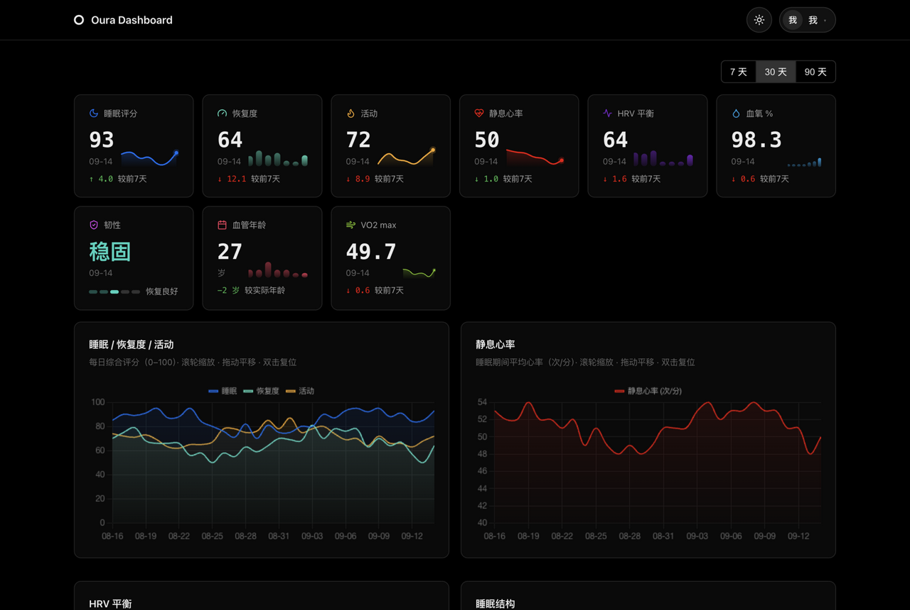
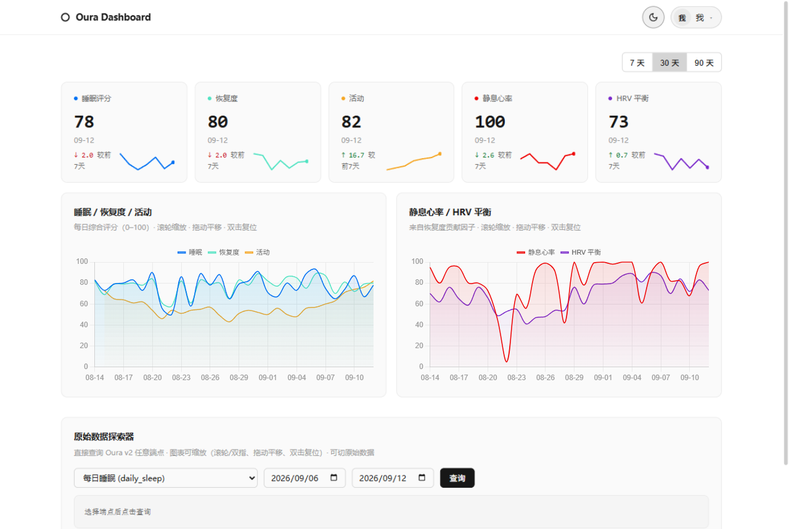
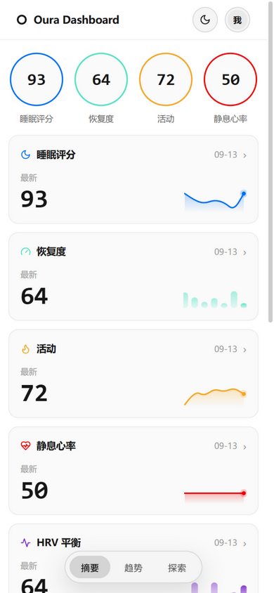

<div align="center">

# oura-worker

**Oura Ring 多用户数据服务 —— Cloudflare Workers + 数据看板 + MCP 服务器**

把你和家人的 Oura Ring 戒指数据接入自己的服务：多用户授权、数据 API、可视化看板，
还能作为 [MCP 服务器](https://modelcontextprotocol.io) 接入 Claude 等 AI Agent，直接用自然语言查询健康数据。

[](LICENSE)
[](https://workers.cloudflare.com)
[](https://modelcontextprotocol.io)

**[🇨🇳 中文说明](#-快速开始)** · [Oura API v2 官方文档](https://cloud.ouraring.com/v2/docs)

</div>

---

| 深色 · 桌面 | 浅色 · 桌面 | 移动端 |
| --- | --- | --- |
|  |  |  |

## ✨ 功能

- **多用户 OAuth2 接入** —— 每个用户通过授权链接接入，数据按 Oura 用户 id 隔离；token 自动刷新（Oura refresh_token 轮换也会正确落库）
- **数据读取 API** —— 代理 Oura v2 全部 18 个数据端点，带 KV 缓存、分页、限流透传
- **数据看板** —— 深色/浅色双主题；桌面端评分卡（迷你趋势线 + 环比箭头）+ 交互式图表（缩放/平移/十字准线）；移动端为原生 App 式交互（圆形指标环、指标卡、圆角柱状图、底部导航、骨架屏）
- **MCP 服务器** —— 无状态 Streamable HTTP，3 个工具（`list_users` / `get_daily_summary` / `get_oura_data`），支持按 email / 备注名定位用户
- **权限隔离** —— 每个用户可生成独立数据 Key，只能查询自己的数据
- **定时任务** —— 每小时自动保活 token 并预取昨日+今日概览，看板秒开
- **Webhook**（可选）—— 接收 Oura 数据更新推送（HMAC-SHA256 校验）

## 🚀 快速开始

### 0. 准备

- 一个 [Cloudflare 账号](https://dash.cloudflare.com/sign-up)（免费套餐即可）
- 一个 [Oura 账号](https://ouraring.com)和 Oura Ring
- 本机安装 [Node.js](https://nodejs.org) ≥ 18 和 Git

### 1. 获取代码并安装依赖

```bash
git clone https://github.com/wenyuanw/oura-worker.git
cd oura-worker
npm install
```

### 2. 登录 Cloudflare

```bash
npx wrangler login
```

浏览器会弹出 Cloudflare 授权页，点击 **Allow**。

### 3. 创建 KV 存储并填入配置

```bash
npm run kv:create
```

命令会输出一个 `id = "xxxx"`，把它填进 [wrangler.toml](wrangler.toml) 的 `kv_namespaces.id`（文件里有注释提示）。

### 4. 部署

```bash
npm run deploy
```

完成后记下 Worker 域名，形如 `https://oura-service.<你的子域>.workers.dev`。

### 5. 配置三个密钥（Secrets）

```bash
npx wrangler secret put OURA_CLIENT_ID      # 下一步创建 Oura 应用后获得
npx wrangler secret put OURA_CLIENT_SECRET  # 同上
npx wrangler secret put ADMIN_KEY           # 自己生成一个管理密钥，如 openssl rand -hex 16
```

> 也可以在 Cloudflare 控制台操作：Workers & Pages → oura-service → Settings → Variables and Secrets。

### 6. 创建 Oura 应用并设置回调地址

1. 打开 [Oura 开发者控制台](https://cloud.ouraring.com/)，登录后进入 **My Applications**
2. 创建应用（个人信息如实填写即可），在 **Redirect URI** 中填入：

   ```
   https://oura-service.<你的子域>.workers.dev/auth/callback
   ```

   ⚠️ 必须与上面完全一致（协议/域名/路径都不能差），否则 Oura 授权时会报 `400 invalid_request`
3. 保存后复制应用的 **Client ID** 和 **Client Secret**，用于第 5 步

> 📖 参考：[Oura API v2 官方文档](https://cloud.ouraring.com/v2/docs) · [认证章节](https://cloud.ouraring.com/v2/docs#section/Authentication)

### 7. 连接你的戒指

浏览器打开：

```
https://oura-service.<你的子域>.workers.dev/auth/oura
```

登录 Oura 并同意授权，账号即接入服务。把同一个链接发给家人，即可接入多个用户（未获 Oura 官方批准的应用最多 10 人）。

### 8. 查看数据

打开看板首页，输入第 5 步设置的 `ADMIN_KEY` 登录。数据由每小时定时任务自动同步，也可点「同步」立即拉取。

### 接入 Claude（MCP）

```bash
claude mcp add --transport http oura https://oura-service.<你的子域>.workers.dev/mcp \
  --header "Authorization: Bearer <ADMIN_KEY>"
```

然后在 Claude 里直接问：「我昨晚睡得怎么样？」——完整的接入文档（含 Claude Desktop 配置、给 Agent 的一键复制 Prompt）在服务的 `/mcp-docs` 页面，也可从看板 → 设置 → MCP 接入进入。

## 🔑 权限模型

| 凭据 | 能做什么 |
| --- | --- |
| `ADMIN_KEY`（管理员） | 看板、所有人数据、设置管理、MCP 多用户查询 |
| 用户个人数据 Key | **只能查询该用户自己的数据**（API 与 MCP 均生效），适合直接交给对应的人 |

个人 Key 在 看板 → 设置 → 个人数据 Key 中生成/重置。

## 📖 API

<details>
<summary>展开 API 列表</summary>

| 方法 | 路径 | 说明 |
| --- | --- | --- |
| GET | `/api/users` | 已接入用户列表 |
| POST | `/api/sync/:userId?days=30` | 立即拉取近 N 天概览数据入缓存 |
| GET | `/api/data/:userId/summary?days=30` | 聚合的每日睡眠/恢复度/活动/静息心率/HRV |
| GET | `/api/data/:userId/:endpoint` | 代理 Oura 端点，支持 `start_date`、`end_date`、`next_token` |
| POST | `/api/connections/:id/disconnect` | 断开用户并清除缓存（管理员） |
| POST | `/api/connections/:id/alias` | 设置用户备注名，MCP 可用 alias 定位（管理员） |
| POST | `/api/connections/:id/key` | 生成/重置该用户的个人数据 Key（管理员） |
| POST | `/api/webhook/subscribe` | 注册 Oura webhook 订阅（管理员） |
| POST | `/webhook/oura` | Oura webhook 接收端（HMAC 签名校验） |
| GET | `/mcp-docs` | MCP 接入文档页 |

`:endpoint` 白名单：`personal_info` `ring_configuration` `daily_activity` `daily_readiness` `daily_sleep` `daily_spo2` `daily_stress` `daily_resilience` `daily_cardiovascular_age` `vo2_max` `rest_mode_period` `sleep` `sleep_time` `heartrate` `session` `workout` `tag` `enhanced_tag`

```bash
curl -s -H "Authorization: Bearer <ADMIN_KEY>" "$BASE/api/data/<userId>/summary?days=7"
```

</details>

## ⏱ 缓存 · 限流 · 定时任务

- 缓存 TTL：`daily_*`/`vo2_max` 等 15 分钟；`heartrate`/`session`/`workout`/`sleep*`/`tag` 5 分钟；`personal_info`/`ring_configuration` 1 小时
- Oura 限流（每 5 分钟 5000 次）触发时透传 `429` 与 `Retry-After`
- Cron（每小时）：刷新所有用户 token（剩余寿命 <12h 时），并预取昨日+今日概览（`CRON_PREFETCH=0` 可关闭）

## 💻 本地开发

```bash
npm run dev   # http://localhost:8787，KV 为本地模拟，无需 Cloudflare 账号
```

本地密钥放在 `.dev.vars`（参考 `.dev.vars.example`，已被 .gitignore 排除）。
本地调试 OAuth 时，把 Oura 应用的 Redirect URI 临时改为 `http://localhost:8787/auth/callback`。

## 🧭 项目结构

```
src/
├─ index.ts       # 路由入口：页面、API、OAuth、webhook、定时任务
├─ oura.ts        # Oura API 客户端（OAuth、token 刷新、代理请求）
├─ data.ts        # 数据层：KV 缓存、用户列表、概览聚合、访问级别
├─ mcp.ts         # MCP 服务器（Streamable HTTP，JSON-RPC 2.0）
├─ mcp-docs.ts    # /mcp-docs 接入文档页
├─ dashboard.ts   # 看板/登录等页面（HTML/CSS/JS）
├─ types.ts       # 类型定义
└─ util.ts        # HMAC、日期工具
```

## ❓ 常见问题

| 现象 | 处理 |
| --- | --- |
| Oura 授权页报 `400 invalid_request` | Redirect URI 与实际回调地址不一致，去 Oura 开发者后台核对 |
| 看板提示「personal_info 未返回用户 id」 | 升级到最新代码（旧版本解析 bug），或确认授权未撤销 |
| `401 unauthorized` | ADMIN_KEY 不对，或 Header 不是「Bearer 密钥」格式 |
| 数据一直为空 | 先完成 `/auth/oura` 授权；Oura 数据需戒指同步后才有 |
| 国内访问 workers.dev 受阻 | 给 Worker 绑定自定义域名，并把 Oura 后台回调地址同步更新 |

## 🔗 相关链接

- [Oura API v2 官方文档](https://cloud.ouraring.com/v2/docs)
- [Oura 认证（OAuth2）说明](https://cloud.ouraring.com/v2/docs#section/Authentication)
- [Oura 开发者控制台（My Applications）](https://cloud.ouraring.com/)
- [Cloudflare Workers 文档](https://developers.cloudflare.com/workers/)
- [Model Context Protocol](https://modelcontextprotocol.io)
- [Hono](https://hono.dev)

## 📄 License

[MIT](LICENSE)
